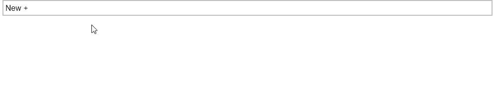
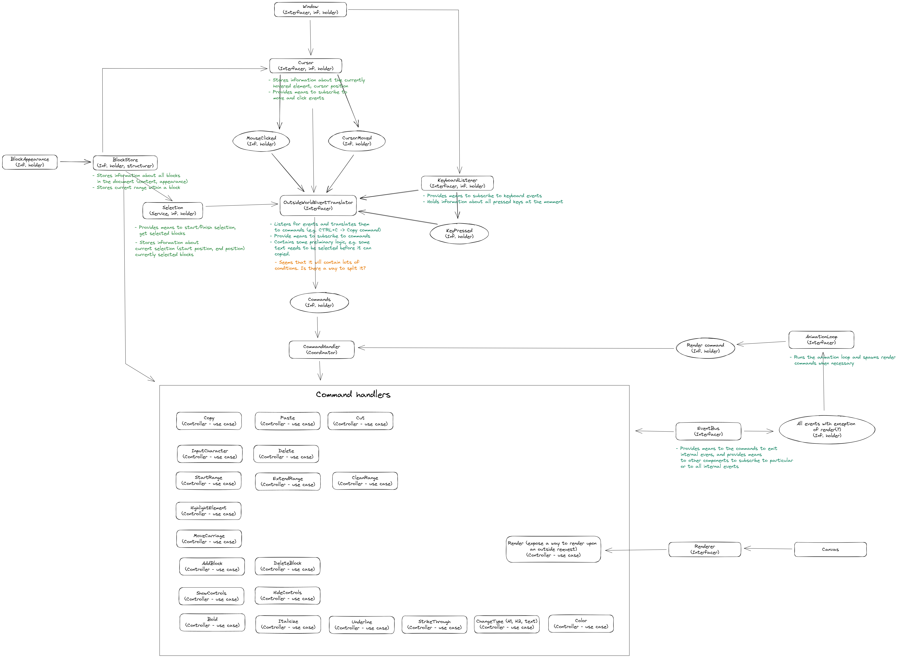

# Overview

A block based canvas text editor.

  
Architecture

  
  #### Main patterns:

  - [Mediator](https://refactoring.guru/design-patterns/mediator)
  - PubSub
  - CQRS

  

  - [Source](docs/architecture.excalidraw)

## Run locally

- `npm ci`
- `npm run start:dev`
- `npm run test:watch`
- `npm run checkTypes:watch`
- Navigate to [http://localhost:5173](http://localhost:5173)

### Technical stats

